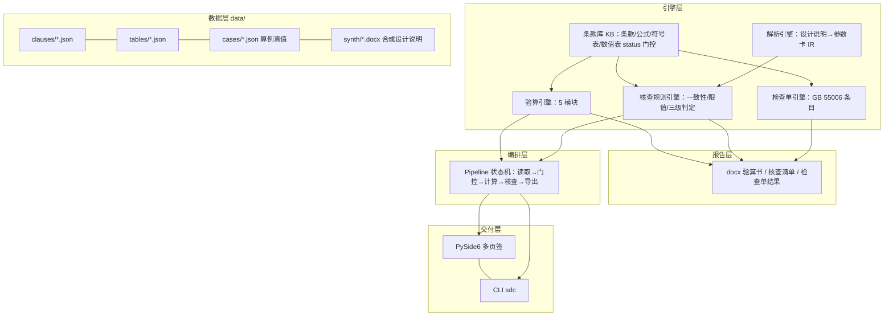

# 03 架构与技术选型

> 上游：[02-需求解读.md](02-需求解读.md)　下游：[04-模块详设.md](04-模块详设.md)

## 一、选型结论

| 层 | 选型 | 理由 |
|---|---|---|
| 语言/运行时 | Python 3.8（本机 `py` 默认 3.8.8，实测存在；同时装有 3.12） | **D12 已定：锁 3.8 开发 + CI 3.8/3.12 双矩阵**。代价是全部源码/测试必须 3.8 兼容写法（禁 `X | Y` 联合类型语法、`dict \| dict` 合并、`str.removeprefix`、`functools.cache` 等 3.9+ 语法与 API）；PySide6 在 3.8 上的可解析最高版本是另一台机器上的实测值（6.6.3.1，6.7+ 元数据 requires-python≥3.9），**M5 前置 spike 已在本机复核并 pin 上限**（R5 关闭：`PySide6>=6.4,<6.7`、`pyinstaller>=6.0,<7`） |
| 计算内核 | 纯 Python + 标准库（`decimal` 不做，浮点 + 显式容差） | 连接验算是确定性公式，不引 numpy/scipy，减小打包面与版本风险 |
| 知识存储 | JSON 文件（条款库/公式库/符号表/数值表/规则表/检查单）+ 加载期 schema 校验 | 可读、可 diff、可脱敏审计；规模小（数百条），不引数据库 |
| 文本抽取 | `python-docx`（docx）+ `pypdf`/`pdfplumber`（PDF，可选 extras） | 0 图像通道；缺依赖时降级为"仅 docx + 纯文本粘贴"并提示 |
| 报告 | `python-docx` 生成验算书 | 赛题要求 docx |
| GUI | PySide6（`pip install sdc[gui]`，extras，上限已按实测 pin：`PySide6>=6.4,<6.7`） | 桌面离线交付；**五页签**（见 §六）。M5 实测：Python 3.8.8 上 pip 可解析的最高版本就是 6.6.3.1（6.7+ 元数据 requires-python≥3.9 被自动回避），构建环境固定用它 |
| 打包 | PyInstaller onedir，双 exe（GUI `console=False` + CLI `console=True`） | onedir 比 onefile 启动稳、易做"dist 树遍历断言"；CLI exe 给无 Python 机器的脚本化验证通路，同时是 GUI 在打包态的解析子进程通路（K45）。M5 实测：PyInstaller 6.22.3 在 3.8 上构建一次通过（上限 pin `pyinstaller>=6.0,<7`） |
| LLM | **不引入** | 本项目全部结论来自公式与规则表；引入即破坏"离线可复现 + 无幻觉"两个卖点 |
| 测试 | pytest（`-p no:cacheprovider` 可选），GUI 测试 offscreen 常驻 | 与确定性纪律一致 |
| CI | GitHub Actions：windows/3.8 + ubuntu/3.8 与 ubuntu/3.12 矩阵（D12） | 干净环境验证的前置；CI 绿是发布门。经验实证：M0 就配齐 `eol=lf` + 冻结 fixtures CR 守门 + extras 覆盖测试期依赖 + 3.8 兼容写法，四矩阵首跑直接全绿，不需要发布期救火 |

## 二、分层架构



**单一事实源**：GUI 与 CLI 都只调 `sdc.engine` / `sdc.pipeline` 的公开 API，不各自实现行为（GUI 无一套自己的判定逻辑）。

## 三、核心机制设计

### 1）条款-公式-符号表引擎（技术创新点，评分项 20 分主战场）

三元结构，任何一条计算结论都能拆到 `标准号 + 条号 + 公式号 + 符号含义`。

> 下例条号取自 07 §二 的**已定位结果**（第 11 章=连接、第 7 章=轴心受力构件）。"已定位"只到条号与主题层，式体与表体数值尚未取到，故 status 只能到 `located`（三态口径见 05 §二）。

- **条款记录**（clause）：`id`（如 `GB50017-2017:11.2.2`）、`standard`、`chapter`、`title`、`status`（`pending` / `located` / `verified`）、`source`（渠道与核对说明）、`extract`（原文摘录，见版权纪律）、`supersedes`、`blocked_on`（该项被哪个待核对项卡住，见 07 §四）、`notes`。
- **公式记录**（formula）：`id`（如 `F-11.2.2-1`）、`clause`、`expr`（Python AST 可解析表达式字符串）、`lhs`/`rhs`、`symbols`（符号表引用）、`applicability`（适用范围谓词，如焊缝质量等级 ∈ {一,二}）、`unit_check`。
- **符号表**（symbol）：`symbol`（如 `h_e`）、`name_zh`（角焊缝有效厚度）、`unit`、`definition`、`clause`（定义出处）、`derivation`（如 `0.7*h_f`）。
- **数值表**（table）：`id`（如 `T-steel-design-value`，对应规范表 4.4.1）、`clause`、`axes`（牌号/厚度分组/质量等级…）、`values`、`interpolation`（分组查表无插值／φ 表按 λ 的插值口径显式声明）、`status`。

**执行契约**：`verify(case) -> Result{conclusion, ratio, steps[], basis[], warnings[], blocked[]}`
- `steps[]` 每步含 `formula_id`、代入值、中间结果、单位——这就是"计算过程透明"；
- `basis[]` = 去重后的条款出处列表，报告直接引用；
- `blocked[]` = 引用了 `status != verified`（即 `pending` 或 `located`）的条款/表值时**拒算**并列出待核对项——纪律落进代码，不是文档承诺；
- `warnings[]` = 强制性条文联动提示（现行强条经核对为 7 条：4.3.2、4.4.1、4.4.3、4.4.4、4.4.5、4.4.6、18.3.3；4.4.2 非强条，见 07 §二.2），命中该计算路径时强制注入。

### 2）status 门控与"待核对不进计算"

加载期断言：凡被 5 个验算模块引用的 `formula/table/clause`，`status != verified` → 该模块标记 `blocked`，界面显示"数据待核对"而非给出数值。真值基准脚本跳过 `blocked` 模块并在报告显式说明，**不得静默通过**。

### 3）文本核查（规则优先，非 CV、非 LLM）

`设计说明 docx/pdf → 纯文本 → 槽位抽取（正则+槽位+合法性范围校验：数值/牌号/等级不在白名单即丢弃）→ 参数卡 IR → 规则表分派（check_type）→ 三级判定（异常/可疑/合规）`。每条 finding 挂 `clause + extract + 证据（文档名/段落/原文）`。类目隔离门控：规则带 `only_if_text` 关键词，防止跨模块误查参数。

### 4）确定性纪律（基准跨机器可复现的根基）

- 生成/落盘路径禁 `random`（用自研 splitmix64 固定 seed）、禁 set 迭代序（一律 `sorted`）、产物**无时间戳**；
- 合成设计说明、真值 JSON、基准产物 → 字节冻结 fixtures 入仓，配"再生成位级一致"守门测试；
- `.gitattributes` `* text=auto eol=lf` + "冻结 fixtures 出现 CR 即失败"守门测试（Windows `core.autocrlf=true` 会打挂全新 clone 的基准，发布门前置）。

### 5）版权与免责纪律

条款库的 `extract` 字段：入库初期以"要点 + 出处"为主（不整条转载规范正文），逐条带 `source` 说明核对渠道；界面与 docx 报告固定免责声明：**辅助验算工具，不替代正式设计文件与施工图审查**。

## 四、目录结构（骨架，M1 起逐步落地）

```
steel-design-checker/
├── pyproject.toml            # extras: gui / report / pdf / pkg / dev
├── src/sdc/                  # sdc = steel design checker
│   ├── kb/                   # 条款库加载、schema 校验、status 门控
│   ├── engine/               # 5 个验算模块 + 公共查表/符号求值
│   ├── parse/                # 设计说明文本抽取 → 参数卡 IR
│   ├── rules/                # 核查规则引擎 + 检查单引擎
│   ├── report/               # docx 验算书/核查清单/检查单
│   ├── pipeline.py           # 轻量状态机（节点/边/重试/耗时）
│   ├── cli.py                # 退出码：0 完成 / 1 降级完成 / 2 输入不可用
│   └── gui/                  # PySide6 页面（只调上面 API）
├── data/
│   ├── clauses/  tables/  symbols/     # 知识库（挂 status+source）
│   ├── cases/                           # 教材/手册算例真值库
│   ├── synth/                           # 合成设计说明（固定 seed 产物，字节冻结）
│   └── README.md                        # 台账
├── scripts/                  # 生成器、基准、脱敏审计、打包断言
├── tests/
├── docs/                     # 技术报告
└── plan/                     # 本套计划文档（入仓，README 深链）
```

## 五、命令面（CLI 契约，定稿后锁进测试）

| 命令 | 作用 | 退出码 |
|---|---|---|
| `sdc run --module weld-butt --case x.json` | 单模块验算，输出 Result（JSON/文本） | 0 / 1（blocked 或降级）/ 2 |
| `sdc bench` | 算例真值库回归（通过率+容差报告） | 0 达标 / 1 未达标 |
| `sdc parse --doc 说明.docx` | 设计说明 → 参数卡 IR | 0 / 2 |
| `sdc check --doc 说明.docx` | 文本核查，输出三级判定清单 | 0 / 1（有异常）/ 2 |
| `sdc checklist --out list.docx` | GB 55006-2021 检查单 | 0 / 2 |
| `sdc report --case x.json --out 验算书.docx` | 验算书导出 | 0 / 2 |
| `sdc synth --seed 20261006` | 重新生成合成设计说明（位级一致校验） | 0 / 1 |
| `sdc selfcheck` | 数据完整性 + 条款 status 审计 + 0 外链断言 | 0 / 1 |
| `sdc gui [--screenshot X.png]` | 桌面界面（M5）；PySide6 缺席时说明装法 | 界面退出码 / 2（缺依赖或数据目录不可用） |

## 六、GUI 形态（M5 已落地）

页签：**① 验算台**（模块选择 + 参数卡表单 + 依据条款面板 + 结果与步骤表）；**② 设计说明核查**（拖入 docx/PDF → 异常清单，可导出）；**③ 通用规范检查单**（逐项核对 → 符合性清单）；**④ 报告导出**；**⑤ 知识库与状态**（条款 status/待核对清单，把纪律做成可见的功能）。

**M5 落地形态（`src/sdc/gui/`，口径 K48/D08/K41）**：

- 五个页签一个不多一个不少（`tests/test_gui_pages.py` 断言页签标题与顺序）；正文面板显示的就是
  命令面用的那一个渲染函数的输出（`render_result`/`render_report`/`checklist.render_text`/
  `selfcheck.render_text`/`suite.render_text`），表格只是同一份 payload 的另一种视图；
- 命令的"算"部分从 `cli._cmd_*` 提成公开函数（`run_card_command`/`check_command`/
  `checklist_command`/`bench_suite_command`/`export_command`/`load_kb_or_error`），**CLI 与 GUI
  调的是同一批函数**，退出码与错误文案因此不可能各说一套；
- 表单不校验：槽位集合取 `MODULE_SLOTS`、枚举候选取 `ENUM_SLOTS`、单位候选取 `UNIT_TABLE`、
  槽位中文名取数据侧符号表 `name_zh`；填错时界面显示的是 `normalize_card` 的原话；
- 页签②的**文档解析在子进程里发生**（口径 K39/K45），界面进程不执行项目正则；通路拿不到时
  界面原样说"通路不可用"，不自己下场；页签⑤的一键基准就是 `sdc bench --all` 那一条命令；
- 页签③的人工答复先落成 JSON 再走 `checklist --answers` 同一条通路，界面不自己判符合性；
- 页签④导出失败（落盘前自检不过）时**不写文件并把原因显示出来**，异常不被吞掉；
- 通知走 `NotifyMixin`（可注入回调 + `messages`），界面源码里出现 `QMessageBox` 即测试失败；
  免责声明常驻窗口顶部与状态栏，不是弹窗。
- 入口：`sdc gui`（源码态）与 `sdc-gui.exe`（打包态）；`sdc gui --screenshot X.png` 用
  native QPA 抓一帧当可演示物。

测试：`QT_QPA_PLATFORM=offscreen` **必须在首次导入 PySide6 之前**设置（`tests/_gui.py` 在
import PySide6 前写死）；消息框/文件对话框 monkeypatch 屏蔽模态；抓帧用 native QPA +
`widget.grab()`（offscreen 拿不到中文字体），存图走 `QBuffer`（`QPixmap.save(BytesIO)` 在
PySide6 6.6 不可用）。

## 七、打包与数据内嵌（M5 已落地）

- onedir 双 exe；spec `datas` **白名单**只收运行必需数据（禁区成分不入包）+ 构建后遍历断言（dist 树无禁区成分、内嵌数据与仓库逐份对账，任一违反 exit 1）；
- `find_data_dir` 优先级：显式参数 > 环境变量 > `sys._MEIPASS/data` > exe 目录 `_internal/data` > CWD 上溯（分支测试锁死，改动属口径变更）；
- 坑位预置：`*.spec` 被 .gitignore 的 `*.spec` 吞掉（加 `!sdc.spec` 例外）；spec 内相对路径解析到 SPECPATH（Analysis 脚本用绝对路径）；PyInstaller 无 `--workers`；

**M5 实测结果（口径 K45/K46/K47）**：

| 项 | 实测 |
|---|---|
| 构建 | `py -3.8 -m PyInstaller --noconfirm sdc.spec` 一次通过（PyInstaller 6.22.3 + Python 3.8.8 + PySide6 6.6.3.1，extras 已按实测钉上限 `PySide6>=6.4,<6.7`、`pyinstaller>=6.0,<7`）；产物 `dist/sdc-cli`（13 MB，无 Qt）与 `dist/sdc-gui`（108 MB） |
| 白名单单源 | `scripts/bundle_rules.py`：入包 `clauses/tables/formulas/symbols/rules/checklist/selfcheck/examples/synth`；**排除** `data/README.md`（台账含渠道 URL，K42）与 `data/cases/`（0 例，只有说明文档；缺目录时 `load_kb` 得 0 条 ⇒ 算例通过率照旧「不可判」） |
| 构建红线 | `scripts/verify_dist.py` → `DIST_AUDIT_OK`：两包各 40 份内嵌数据与仓库逐份 sha256 相同（含 `data/synth/docx/` 子目录）且不许多出文件；禁区成分 0；PySide6 只在 GUI 包；GUI 邻接目录找得到 `sdc-cli.exe` |
| 冻结态子进程 | `suite.cli_channel()` 在 `sys.frozen` 下改用同侧/邻接的 `sdc-cli.exe`（`SDC_CLI_EXE` 可显式指定），拿不到 ⇒ 指标记「不可用」。实跑证据：`.tmp_verify/m5/frozen_bench_all.txt` 里"确定性回归＝达标，24 份 IR 两次一致"，数据目录指向包内 `_internal/data` |
| 干净环境 | `scripts/clean_env_check.py` → `CLEAN_ENV_OK`：把两个包复制到 `%TEMP%` 中立目录、PATH 里没有任何 Python、`PYTHONPATH/PYTHONHOME/SDC_*` 全部剥除后，CLI 六连（selfcheck 0／run 1／parse 0→check 1／checklist 0／report 1／bench --all 1）+ `SDC_DATA_DIR` 覆盖 + GUI 存活探针 + `sdc-cli.exe gui` 老实报"桌面界面不可用"（rc=2，因为该包里按设计没有 PySide6）共 10 项全过 |
| 编码坑 | 冻结 exe 的 stderr 跟随系统代码页（本机 GBK）而 stdout 已是 UTF-8 ⇒ 新增 `cli._err()` 把两条流钉成同一口径（K47），由干净环境验证抓回 |

## 八、里程碑映射

见 [05-数据计划与里程碑.md](05-数据计划与里程碑.md)。技术选型风险点（R5 打包/依赖版本）在 M5 前置 spike 消化。
